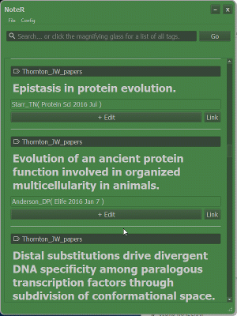
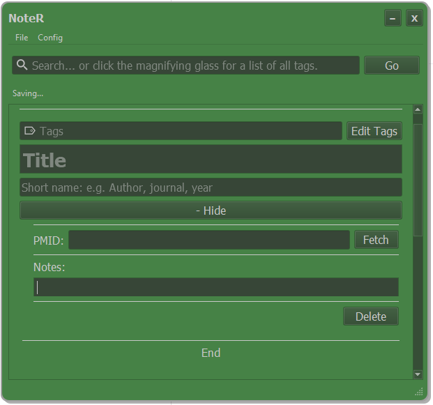

# Welcome to the home of NoteR!

# What is NoteR?

NoteR is a light, academic paper tracking program written by a graduate student
in biochemistry. Meant to be the post-it notes of paper tracking programs, it
is fairly minimalistic and tries to cover all the basic note taking needs to
make your life a little easier. NoteR is provided under the GNU General Public License 3.0.

Reading papers and exploring the world of academic discoveries is fun, but spending
time to organize all the things you've read can be quite tedious. NoteR tries to make
it a bit easier, by giving you a space that is specifically designed to keep the 
basic necessities in one place. 

Of course, there are other paper management programs out there. But do give NoteR
a try if you like programs that are light ( and FREE! ).

## The main features can be summarized in a few points:

* NoteR allows you to keep the title, author info and your own notes together
  in organized entries.
* Papers can be grouped by your own personal tags.
* A search function allows you to easily sort through entries.
* NoteR allows paper information to be fetched using pubmed IDs, which also
  provides a link to the paper's website.
* Pdf files can be automatically named and stored according to author
  information, simply by drag and drop
* Multiple color schemes, choose one that's easy on your eyes.

# Installing and Using NoteR

NoteR comes as a bundled executable or as source code that can be run directly in python.

## Executables

Executable versions of NoteR are available for Windows and Mac, and can be found [here](https://github.com/johnchen93/NoteR/releases).

Simply unzip the downloaded file containing NoteR into a directory, and run NoteR.exe inside the unzipped folder.

## Running NoteR from Source

NoteR is made using [Python 3.6](https://www.python.org/downloads/), and can be run directly from the source code provided you have Python 3.6 with the basic dependencies installed.

Simply navigate to the source folder in command line or terminal and use the following command:

`python noter_2.py`

As a side note, NoteR will create some new folders the first time is is run. These will be placed at the same level as the folder containing the source code. These folders can be relocated anywhere as long as the source folder is moved along with it.

### Python Dependencies
NoteR requires [pyqt5](https://pypi.org/project/PyQt5/) for the GUI and [beautifulsoup4](https://pypi.org/project/beautifulsoup4/) for fetching information from PubMed.

It is recommended to install python and the packages with some sort of package manager, such as [Anaconda](https://www.anaconda.com/download/). This allows you to create python environments with different python versions and packages, in case python 3.6 is not your main work environment. 

Otherwise, you can also install python 3.6 directly and use pip to install pyqt5 and beautifulsoup4.

# Bugs

If you find a bug with the program, please report them here under [issues](https://github.com/johnchen93/NoteR/issues). Please include the information on what causes the problem, as well as what NoteR type (source or executable) and operating system you use. 

I will try to fix these as quick as possible.

## Current Known Issues

1. Mac executable only (windows and source code are okay) - Notes section cannot be editted after a search, if the search results were not found inside the text box. To fix this, enter a search term that will match the desired text box. I will try to fix this the next time I have access to a Mac with a python installation.
